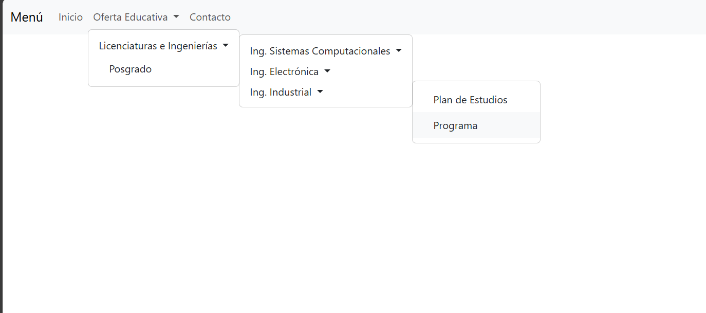

# 🖥️ Proyecto: Menú Interactivo con Flask y Bootstrap

**Autor:** Onar Gutierrez Gracia

---

## Introducción
Este repositorio contiene una aplicación web desarrollada en Python utilizando el microframework Flask. El objetivo principal es mostrar cómo construir un menú de navegación interactivo y adaptable, generado dinámicamente desde una estructura de datos en Python y presentado con estilos modernos gracias a Bootstrap.

---

## ¿Qué hace esta app?
- Presenta un menú horizontal en la parte superior de la página.
- Permite navegar por diferentes niveles de submenús.
- El menú se adapta automáticamente a cualquier cambio en la estructura de datos.
- El diseño es limpio, profesional y compatible con dispositivos móviles.

---

## Archivos relevantes
- **main.py**: Lógica principal de la aplicación y definición del menú.
- **templates/menu.html**: Plantilla HTML con el menú generado dinámicamente.
- **menu.png**: Captura de pantalla de la interfaz.

---

## Cómo ponerlo en marcha

### 1. Prepara tu entorno
- Asegúrate de tener Python 3 instalado.
- (Recomendado) Crea un entorno virtual:
  ```bash
  python -m venv entorno
  # Windows:
  entorno\Scripts\activate
  # Linux/Mac:
  source entorno/bin/activate
  ```

### 2. Instala las dependencias necesarias
```bash
pip install flask
```

### 3. Ejecuta el servidor
```bash
flask --app main run
```
O bien:
```bash
python main.py
```

### 4. Visualiza la aplicación
Abre tu navegador y accede a:
```
http://localhost:5000/
```

---

## Características técnicas
- Menú generado a partir de un diccionario anidado en Python.
- Submenús ilimitados, renderizados de forma recursiva.
- Uso de Bootstrap desde CDN para responsividad y estilo.
- Código limpio y fácil de modificar.
- No requiere bases de datos ni configuración adicional.

---

## Personalización
- Para modificar las opciones del menú, edita el diccionario `menu` en `main.py`.
- Puedes cambiar los estilos editando el bloque `<style>` en `menu.html` o agregando tus propias clases de Bootstrap.
- Si deseas agregar nuevas páginas, puedes crear nuevas rutas en Flask y enlazarlas desde el menú.

---

## Vista previa



---

## Preguntas frecuentes

**¿Puedo usar este menú en otro proyecto Flask?**
> Sí, solo copia el diccionario y la macro de renderizado a tu proyecto.

**¿Funciona en dispositivos móviles?**
> Sí, gracias a Bootstrap el menú es responsivo.

**¿Puedo agregar más niveles de submenú?**
> ¡Por supuesto! El menú es recursivo y soporta cualquier profundidad.

---

## Créditos y agradecimientos
- Bootstrap (https://getbootstrap.com/)
- Flask (https://flask.palletsprojects.com/)

---

¿Tienes dudas o sugerencias? ¡Abre un issue o contáctame!
